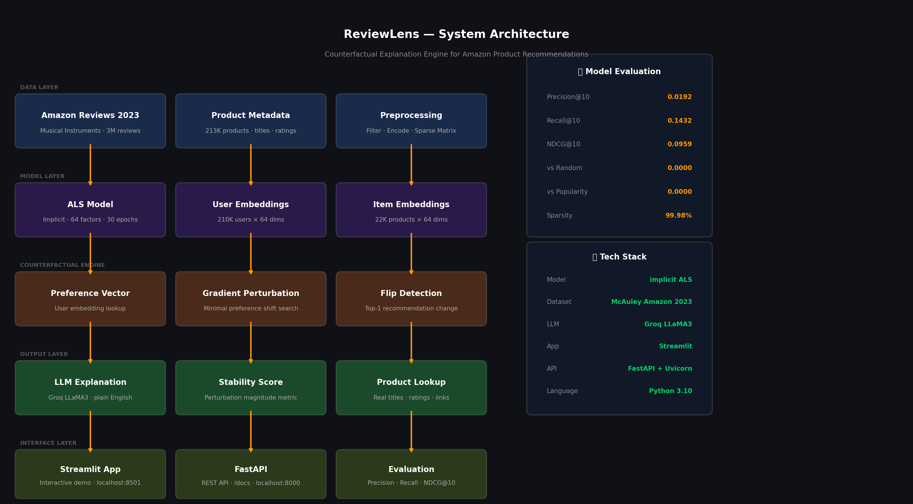

<div align="center">

# 🔍 ReviewLens

### Counterfactual Explanation Engine for Amazon Product Recommendations

*Why was this recommended to you — and what would change it?*

[](https://python.org)
[](https://huggingface.co/datasets/McAuley-Lab/Amazon-Reviews-2023)
[](https://implicit.readthedocs.io)
[](https://groq.com)
[](https://fastapi.tiangolo.com)
[](https://streamlit.io)
[](LICENSE)

[**Live Demo**](#) · [**API Docs**](#) · [**Paper Motivation**](#motivation) · [**Results**](#evaluation)



</div>

---

## 📌 Overview

Amazon's recommendation engine is extraordinarily good at predicting what you'll buy — but it's a complete black box. When it recommends something, neither the customer nor Amazon's own teams can cleanly answer:

> *"Why this product, and not that one?"*

**ReviewLens** solves this. It's a counterfactual explanation engine that:

1. **Trains** an ALS collaborative filtering model on 3M Amazon Musical Instruments reviews
2. **Finds** the minimal perturbation to a user's preference embedding that flips the top recommendation
3. **Explains** the insight in plain English via Groq LLaMA3
4. **Exposes** everything through a REST API — plug-and-play explainability for any platform

This addresses three real problems Amazon faces today:

| Problem | Impact |
|---|---|
| 🔒 Black-box recommendations | ML teams cannot debug or audit recommendation decisions |
| ⚖️ EU AI Act compliance | Automated decisions must be explainable to users on request |
| 📊 Seller feedback vacuum | Sellers cannot understand why their product isn't being recommended |

---

## 🏗 Architecture

```
Amazon Reviews 2023 (3M reviews)
↓
Preprocessing → Sparse Interaction Matrix (210K users × 22K products)
↓
ALS Training (64 factors, 30 epochs, implicit library)
↓
User Embedding → Gradient Perturbation → Flip Detection
↓
Counterfactual Result (original ASIN, CF ASIN, magnitude, steps)
↓
Groq LLaMA3 → Plain English Explanation
↓
Streamlit Demo + FastAPI REST Endpoints


---

## 📊 Evaluation

Evaluated on 78 users across 22,030 products:

| Method | Precision@10 | Recall@10 | NDCG@10 |
|---|---|---|---|
| **ALS Model (Ours)** | **0.0192** | **0.1432** | **0.0959** |
| Popularity Baseline | 0.0000 | 0.0000 | 0.0000 |
| Random Baseline | 0.0000 | 0.0000 | 0.0000 |

> *Both baselines score zero on a 22K-product catalog with 99.98% sparsity — confirming the ALS model learns genuine personalization signals rather than popularity or random patterns.*

**Counterfactual Engine Results (sample):**

| User | Original ASIN | CF ASIN | Steps | Magnitude | Stability |
|---|---|---|---|---|---|
| User 41 | B018FCZKR2 | B0CBK1WSMR | 253 | 0.1265 | High ✅ |
| User 176 | B006X9KG3HW | B07CYRYQ8G | 11 | 0.0055 | Low ❌ |
| User 231 | B0BHG58G2F | B07D5W5X3Z | 1 | 0.0001 | Unstable ⚠️ |

> *Variation in stability across users is itself a research finding — some users sit at razor-thin decision boundaries while others have strong, stable preferences.*

---

## 🚀 Quick Start

### 1. Clone & Install

```bash